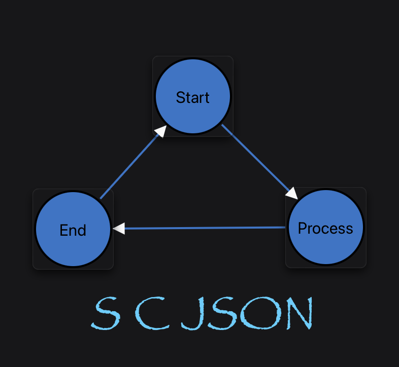

<p align="center"></p>

# scjson C# Package

This directory contains the .NET implementation of **scjson**, providing a command line tool and library to convert between `.scxml` and `.scjson` files.

## Installation

```bash
dotnet build csharp/ScjsonCli
```

After building you can run the CLI with:

```bash
dotnet run --project csharp/ScjsonCli -- json path/to/machine.scxml
```

## Command Line Usage

```bash
scjson json path/to/machine.scxml
scjson xml path/to/machine.scjson
scjson validate path/to/dir -r
```

All source code in this directory is released under the BSD 1-Clause license. See [LICENSE](./LICENSE) and [LEGAL.md](./LEGAL.md) for details.
