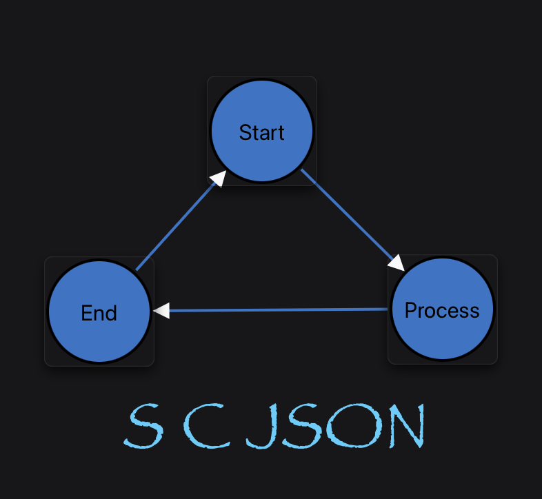

Agent Name: scjson-converter-concepts

Part of the scjson project.
Developed by Softoboros Technology Inc.
Licensed under the BSD 1-Clause License.

# SCJSON-CONV-00 Concepts: Converter and Schema Semantics

## Section 0. Authority Policy

This document scopes the converter/schema initiative created by
`SCJSON-00-CONCEPTS.md`. It is the planning document for replacing the stale
inference guide with a current converter contract.

Normative sections: Section 3, Section 4, Section 5, Section 6, Section 7, and
Section 9.

Informative sections: Section 1, Section 2, Section 8, Section 10, and
Section 11.

Normative keywords **MUST**, **MUST NOT**, **SHOULD**, **MAY**, and
**RECOMMENDED** are interpreted per RFC 2119 and RFC 8174 when capitalized.

## Section 1. Purpose

The old `INFERENCE.md` captures useful examples but names the JavaScript
converter as the source of truth and lists a stale structural-field set. This
initiative creates a schema-first converter contract so every language can
implement the same SCXML to SCJSON projection without re-deriving rules from a
single implementation.

## Section 2. Current Drift

- `INFERENCE.md` says JavaScript owns inference behavior.
- `docs/COMPATIBILITY.md` says Python output is canonical for converters.
- `js/src/converters.js` includes structural tags absent from `INFERENCE.md`.
- `py/uber_test.py` has its own structural-field normalization set.
- Generated pydantic models now accept typed JSON metadata in
  `other_attributes`, while dataclass models intentionally remain string typed
  for XML serializer compatibility.

## Section 3. Canonical Definitions

### Converter Reference

Python converter output is canonical for language parity. Other converters
conform by matching Python output under the relevant harness and normalization
rules.

### Schema Reference

`scjson.schema.json` and generated pydantic models define the canonical SCJSON
field surface. Converter constants are mirrors and MUST NOT introduce fields
that are absent from the schema without a schema/model change.

### XML Element Name vs. SCJSON Field Name

Some XML element or attribute names map to different SCJSON property names to
avoid language/schema conflicts:

- XML `type` attribute maps to SCJSON `type_value`.
- XML `raise` element maps to SCJSON `raise_value`.
- XML `if` element maps to SCJSON `if_value`.
- XML `else` element maps to SCJSON `else_value`.
- XML `initial` attribute maps to SCJSON `initial_attribute`.
- XML `datamodel` attribute maps to SCJSON `datamodel_attribute`.

### Extension Metadata

Pydantic `other_attributes` fields MAY contain JSON-typed metadata. Dataclass
`other_attributes` fields remain string typed because xsdata XML serialization
requires XML attribute values.

### Help Text

`help_text` is a proposed SCJSON authoring metadata field, owned by this
converter/schema initiative until it is promoted into generated schema
artifacts. It is a child-element-style array of strings attached to any SCJSON
element that can carry author-facing documentation. It is distinct from
`other_attributes`: `help_text` carries chart documentation for editors,
visualizers, code generators, and assistants; `other_attributes` carries
extension attributes and editor/tooling metadata.

`help_text` MUST NOT affect SCXML validation, state-machine execution,
transition selection, datamodel evaluation, or trace output.

### SCXML Comment Promotion

SCXML comments are lexical XML nodes, not SCXML execution semantics. When
comment preservation is enabled by this initiative, SCXML comments are promoted
into semantic SCJSON authoring metadata instead of being preserved as a
positional sidecar.

The promotion target is `help_text`. The promoted value is the XML comment text
without the `<!--` and `-->` delimiters. Converter implementations SHOULD trim
only delimiter-adjacent indentation needed to recover the author's text; broad
rewrapping and concatenation are not part of promotion.

## Section 4. Frozen Converter Invariants

- CONV-INV-1: SCJSON conversion MUST preserve SCXML hierarchy and executable
  ordering.
- CONV-INV-2: List-valued schema fields MUST remain arrays in canonical SCJSON,
  even for one child.
- CONV-INV-3: Token attributes such as transition `target` and state/root
  `initial` MUST be split into arrays where the schema marks token lists.
- CONV-INV-4: Unknown extension content MUST remain representable through
  `content`, `other_element`, or `other_attributes` surfaces.
- CONV-INV-5: Converter parity changes MUST update Python output, generated
  schema artifacts, and parity harness expectations in one change.
- CONV-INV-6: Localized docs MUST NOT be generated or maintained in this repo;
  softoboros.com owns translated publication.
- CONV-INV-7: `help_text` and promoted SCXML comments MUST NOT alter canonical
  execution semantics or trace output.
- CONV-INV-8: Comment promotion MUST be deterministic across Python and
  JavaScript converters; Python remains the canonical output.

## Section 5. Structural Field Registry

The authoritative registry is the generated schema. The current implementation
surface to audit and align is:

| Family | SCJSON field(s) | Notes |
|--------|------------------|-------|
| state hierarchy | `state`, `parallel`, `final`, `history`, `initial`, `transition` | `transition` is list-valued for states/parallel and scalar under `initial`/`history` in generated models. |
| executable containers | `onentry`, `onexit`, `finalize`, transition actions | Preserve authoring order. |
| executable actions | `assign`, `log`, `raise_value`, `if_value`, `foreach`, `send`, `cancel`, `script` | XML names may differ from SCJSON field names. |
| payloads | `content`, `param`, `donedata`, `datamodel`, `data` | Mixed content and typed JSON payload behavior needs explicit tests. |
| invokes | `invoke`, `finalize`, `content`, `param` | Invoke semantics are owned by execution docs, but representation is owned here. |
| chart inclusion and communication | `invoke`, `send`, `content`, `param`, `donedata`, `data.src`, `script.src`, XInclude extension nodes, `src`, `srcexpr`, `target`, `targetexpr`, `type_value`, `typeexpr`, `event`, `eventexpr`, `namelist`, `autoforward` | CONV-H owns root-reachable representation coverage. |
| extensions | `other_element`, `other_attributes` | Preserve unknowns within schema-supported surfaces. |
| authoring metadata | `help_text` | Proposed public schema field for chart documentation and promoted SCXML comments. |

Changes to this registry require Standards Action because they affect every
language converter and generated type surface.

## Section 6. Work Packages

### CONV-A: Schema Field Registry Audit

Goal: mechanically compare generated pydantic fields, JavaScript converter
constants, and `py/uber_test.py` normalization constants.

Output:

- A generated or hand-maintained table of schema list fields.
- A decision list for mismatches such as `transition`, `if_value`, `else_value`,
  `raise_value`, `content`, and `other_element`.

Dependencies: `SCJSON-00-CONCEPTS.md`.

Independent from: execution semantics, Ruby engine behavior.

### CONV-B: Typed Extension Metadata Tests

Goal: prove the 0.3.7 pydantic `other_attributes: dict[str, Any]` behavior and
the dataclass `dict[str, str]` split.

Output:

- Focused Python tests for pydantic and pydantic_strict typed metadata.
- Release-note text for the pydantic/dataclass split.

Dependencies: none beyond the current branch.

Independent from: converter registry audit.

### CONV-C: Inference Guide Replacement

Goal: replace or archive `INFERENCE.md` after its examples are moved into a
current converter guide.

Output:

- New active converter guide citing this concepts doc.
- Archive header or removal plan for the old guide.

Dependencies: CONV-A.

Independent from: Python release hardening after CONV-B is done.

### CONV-D: Generator Tool Packaging Decision

Goal: decide whether generation scripts are package artifacts or repository-only
maintenance tools.

Output:

- `MANIFEST.in` and package metadata changes if scripts ship.
- Otherwise, a documented repository-only generator workflow.

Dependencies: CONV-B for release-note wording.

Independent from: execution semantics.

### CONV-E: Help Text Schema Surface

Goal: add `help_text: list[str]` as first-class SCJSON authoring metadata.

Applies-to model families:

- `help_text` applies to SCJSON element models that can carry XML attributes or
  child content, not to scalar datatype/enumeration models.
- The initial schema/model surface SHOULD mirror the current
  `other_attributes` element-model surface: `Scxml`, `State`, `Parallel`,
  `Final`, `History`, `Initial`, `Transition`, `Onentry`, `Onexit`, `Invoke`,
  `Finalize`, `Datamodel`, `Data`, `Donedata`, `Content`, `Param`, `Assign`,
  `Log`, `Raise`, `If`, `Elseif`, `Else`, `Foreach`, `Send`, `Cancel`, and
  `Script`.
- `help_text` is intentionally separate from `other_attributes`. Core SCJSON
  schema changes for `help_text` MUST NOT close or reinterpret optional
  registry schemas for `other_attributes` conventions.

Canonical conversion and output rules:

- `help_text` is optional. When absent or empty, converters MUST omit it from
  canonical JSON when their existing omit-empty mode is enabled.
- When present, `help_text` MUST be an array of strings. Converters MUST NOT
  collapse a single entry to a scalar string.
- Entry order is authoring order. Converters MUST NOT sort, deduplicate, merge,
  or rewrap entries.
- Empty strings SHOULD be rejected by schema/model validation if the generator
  supports that constraint; if not, converters SHOULD drop empty promoted
  comments before model validation. Whitespace-only comments are not authoring
  documentation.
- `help_text` MUST NOT be copied into `other_attributes.description`, and
  `other_attributes.description` MUST NOT be silently promoted during generic
  conversion. Product-specific migrations MAY migrate legacy description fields
  under CONV-G guidance.
- `help_text` MUST NOT affect SCXML validation, executable ordering, transition
  selection, datamodel evaluation, trace output, or engine conformance.

Python plumbing expectations:

- Generated dataclass, pydantic, and pydantic_strict model surfaces MUST expose
  `help_text` as an optional list of strings on the applies-to models above.
- `SCXMLDocumentHandler.xml_to_json()` remains the canonical Python conversion
  entry point. Once CONV-F lands, any comment-preserving pre-pass MUST run
  before xsdata parsing and MUST hand xsdata comment-free SCXML plus a
  deterministic element-to-`help_text` annotation map.
- `SCXMLDocumentHandler.json_to_xml()` MUST accept canonical `help_text` and
  route it to the SCXML emitter without requiring callers to use
  `other_attributes`.

JavaScript plumbing expectations:

- The JavaScript converter MUST treat `help_text` as a known structural
  metadata key for SCJSON input/output cleanup, array preservation, and empty
  pruning.
- `xmlToJson()` MUST match Python canonical output for `help_text`, including
  omission of empty arrays and preservation of entry order.
- `jsonToXml()` MUST emit comments from `help_text` without treating them as
  attributes or generic `content`.

Output:

- Generated pydantic and dataclass surfaces carry `help_text` where supported
  by SCJSON element models.
- `scjson.schema.json` validates `help_text` as an optional array of strings.
- Language bindings expose the field idiomatically without requiring consumers
  to parse `other_attributes`.
- Absence of `help_text` leaves canonical output unchanged for existing
  SCJSON documents.

Dependencies: `SCJSON-00-CONCEPTS.md`.

Independent from: execution semantics and engine trace behavior.

### CONV-F: SCXML Comment Promotion

Goal: preserve useful SCXML comments by promoting them into `help_text` instead
of preserving lexical XML positions.

Canonical promotion rules:

1. A comment node immediately before an element sibling attaches to that next
   element sibling.
2. A run of consecutive comments and whitespace-only text before an element
   attaches to that next element sibling, one `help_text` entry per comment in
   document order.
3. A comment with no following element sibling attaches to its parent element.
4. Comments before the root `<scxml>` element, after the root element, or
   otherwise outside the document element attach to the root `Scxml` object.
5. Comments inside `<script>` and `<data>` content, including comments in
   CDATA-backed target-language source, remain content and MUST NOT be
   promoted.
6. Comments inside arbitrary unknown XML preserved through `content` or
   `other_element` remain lexical content of that extension subtree unless the
   extension subtree is parsed into a supported SCJSON element model.
7. Multiple comments attached to the same element append to existing
   `help_text` entries after any entries already present in the source SCJSON
   or intermediate model.
8. Promotion text is the XML comment text without `<!--` and `-->`. Converters
   SHOULD remove one common indentation margin from multi-line block comments
   and trim leading/trailing blank lines, but MUST NOT paragraph-wrap,
   concatenate adjacent comments, normalize internal line endings beyond the
   repo's existing JSON string normalization, or decode text as executable
   content.

Deterministic edge cases:

- Comments separated from the next element only by whitespace attach to the next
  element. Comments separated by non-whitespace character data attach to the
  parent because the next-element intent is ambiguous.
- For `<state><!-- a --><transition/>text<!-- b --></state>`, `a` attaches to
  the `Transition`; `b` attaches to the `State`.
- For `<state><transition/><!-- trailing --></state>`, `trailing` attaches to
  the `State`, not the preceding `Transition`.
- For `<state><!-- a --><!-- b --><onentry/></state>`, both comments attach to
  the `Onentry` in order.
- For comments before a nested `<scxml>` inside `<content>`, the promotion
  target is that nested `Scxml` if the nested machine is parsed as SCJSON;
  otherwise the comment remains part of the extension content.
- XML processing instructions, DTD declarations, and entity declarations are
  not comments and MUST NOT produce `help_text`.

Parser plumbing expectations:

- Python MUST use a comment-preserving XML reader for the pre-pass because
  `xml.etree.ElementTree.fromstring()` and xsdata parsing do not preserve
  comments by default.
- The Python pre-pass SHOULD produce stable element addresses before namespace
  insertion/defaulting mutates the tree. Acceptable addresses are deterministic
  sibling-index paths scoped to element nodes.
- JavaScript MUST enable comment preservation in its XML parser or run an
  equivalent tokenizing pre-pass before the existing `fast-xml-parser`
  normalization pipeline discards comments.
- Both implementations MUST apply namespace insertion, token splitting, array
  normalization, and default-value normalization after promotion in a way that
  leaves the same final JSON as Python.

SCJSON to SCXML emission rule:

- Each `help_text` entry emits as a leading XML comment immediately before the
  owning element.
- Round-trip fidelity is content-preserving, not character-preserving.
- Consumers needing exact lexical XML fidelity should keep the original SCXML
  source; SCJSON is the semantic authoring surface.
- Comment text MUST be XML-comment safe on emission. Emitters MUST escape XML
  metacharacters as needed by the serializer and MUST NOT emit the forbidden
  comment sequence `--` or a trailing `-` before the closing delimiter. The
  canonical repair is replacing each `--` with `- -` and appending one space
  when a comment body would end in `-`.
- Emitted comments precede the owning element after indentation for that
  element and before the element start tag. For the root `Scxml`, root-level
  `help_text` emits after the XML declaration and before `<scxml>`.
- When an element owns multiple `help_text` entries, emit one XML comment per
  entry in array order. Emitters MUST NOT coalesce entries into a single
  multi-line comment.
- `help_text` is an SCJSON-only metadata field. It MUST NOT also serialize as
  an SCXML attribute, child element, or `other_attributes` entry.

Focused test matrix:

- Schema/model: every applies-to model accepts `help_text: ["..."]`; scalar
  datatype/enumeration models do not expose `help_text`; empty/missing
  `help_text` is omitted in canonical JSON.
- Python parser: root-leading, root-trailing, parent-trailing, nested-state,
  transition-leading, onentry/onexit-leading, multiple-consecutive, and
  whitespace-separated comments promote to the expected element.
- JavaScript parser: the same vectors produce byte-for-byte canonical JSON
  parity with Python after the existing normalization harness.
- Non-promotion: comments inside `<script>`, comments inside `<data>` inline
  XML/source content, processing instructions, and comments inside opaque
  extension subtrees do not become `help_text`.
- Emission: `help_text` on root, state, transition, executable action, payload,
  and script-capable models emits before the owning SCXML element and validates
  with the W3C SCXML schema after stripping comments.
- Escaping: comment text containing `<`, `&`, `>`, `--`, trailing `-`, leading
  indentation, and multi-line content emits as valid XML and round-trips back
  to the canonical repaired `help_text` string.
- Round trip: `SCXML comments -> SCJSON help_text -> SCXML comments -> SCJSON
  help_text` preserves entry count, order, owning element, and repaired text.
- Semantics: engine traces for machines with and without equivalent
  `help_text` are identical.

Output:

- Python converter pre-pass using a comment-preserving XML tree before xsdata
  parsing.
- JavaScript converter parity using the same promotion rule.
- Focused tests for root, leading, trailing, nested, multiple, transition, and
  script/data comment cases.

Dependencies: CONV-E.

Independent from: engine execution and trace output.

### CONV-G: Extension Metadata Registry and Optional Schemas

Goal: document common `other_attributes` conventions without conflating them
with `help_text`. `other_attributes` remains an open extension surface in the
core SCJSON schema; registry schemas are optional/suggested validation aids for
tools that recognize a convention.

Initial registry input:

- Infinity State layout and editor metadata conventions: `position`, `arc`,
  `skew`, `base_pos`, `arrow_pos`, `help_text_box`,
  `condition_text_box`, and document/editor display metadata.
- Legacy documentation metadata: `description`, to be treated as a migration
  source for `help_text` by products that already wrote it.

Output:

- A scjson concepts or registry document describing `other_attributes` as
  extension metadata, not executable semantics:
  `SCJSON-OTHER-ATTRIBUTES-00-CONCEPTS.md`.
- A separate optional schema catalog for documented `other_attributes`
  conventions. The catalog SHOULD identify the stored key, applies-to object
  types, value shape, schema URI or planned schema URI, casing, and migration
  notes for each entry.
- A full initial inventory of existing Infinity State-derived entries and newly
  planned annotation entries, including document display, title style, node
  position, transition geometry, style overrides, datamodel schema metadata,
  `help_text_box`, and `condition_text_box`.
- A reconciliation backlog for discovered downstream keys that are not yet
  preferred registry entries, including legacy coordinate spellings,
  document-level codegen/layout hints, transition render identifiers, and
  schema/style naming drift.
- A migration note for products that currently use
  `other_attributes.description`.
- A casing note: canonical SCJSON uses snake_case field names; product APIs MAY
  map to camelCase on their own wire surfaces.
- A compatibility note: the core SCJSON schema MUST continue to preserve
  unknown `other_attributes` keys; optional registry schemas MUST NOT make
  unrecognized extension metadata invalid unless a product explicitly opts into
  strict validation for that registry.
- Downstream editor and visualizer guidance: consumers MAY expose `help_text`
  in inspectors, tooltips, or optional canvas annotations, but display choices
  are product policy and MUST NOT affect runtime semantics.
- Downstream annotation geometry guidance: products MAY store per-object
  help-text and condition-text annotation geometry as extension metadata; those
  fields remain editor/visualizer metadata and MUST NOT affect execution.

Dependencies: CONV-E for the `help_text` distinction.

Independent from: comment promotion mechanics.

### CONV-H: Root-Reachable Chart Inclusion and Communication Surface

Goal: make every SCXML chart inclusion and inter-chart communication construct
first-class in the SCJSON representation, generated schema/type graph, language
bindings, and converter parity tests when starting from the root `Scxml`
document type.

Problem statement:

- Downstream iState work exercises the root SCJSON document as the authoring
  and validation entry point. If generated bindings only expose the direct
  children of `Scxml`, tools can miss legal nested constructs such as `send`,
  `invoke`, `param`, `content`, `donedata`, and nested `Scxml` payloads.
- "Support from the top" means root-reachable coverage through the schema/type
  graph. It does not mean that the root `<scxml>` element directly accepts
  executable children that W3C SCXML does not permit.

Canonical definitions:

- A chart inclusion surface is any SCXML representation path that lets one
  chart contain, reference, start, communicate with, or return data from another
  chart/session.
- An external resource inclusion surface is any SCXML representation path that
  fetches non-chart document content into the chart, including `data.src`,
  `script.src`, and optional XML XInclude preprocessing.
- Root-reachable means the construct is discoverable by walking schema/model
  references from `Scxml`, including nested executable-content and payload
  references. Generators MUST NOT prune the construct merely because it is not a
  direct root child.
- Direct-root legality remains the W3C SCXML grammar. `Scxml` may contain the
  root-supported structural fields (`state`, `parallel`, `final`, `datamodel`,
  `script`, metadata, and extension surfaces) but MUST NOT gain direct root
  `send`, `invoke`, `onentry`, `onexit`, `transition`, or `finalize` fields
  unless a future SCXML authority relationship explicitly permits them.

Representation coverage:

- Optional XInclude preprocessing MUST be treated as a standard SCXML document
  assembly path. Converters MAY expose a resolved mode, where XInclude is
  processed before SCJSON conversion and only the resulting SCXML tree is
  represented, and an unresolved mode, where `xi:include` extension nodes are
  preserved through `other_element` or generic content. The chosen mode MUST be
  explicit in tests and user-facing converter docs.
- `invoke` MUST remain represented on state-like containers where SCXML permits
  it, including all child chart reference mechanisms: `src`, `srcexpr`,
  `type_value`, `typeexpr`, `id`, `idlocation`, `namelist`, `autoforward`,
  `param`, `content`, and `finalize`.
- Inline chart inclusion through `invoke.content` MUST preserve a nested
  `Scxml` document when the payload is an SCXML chart. `Content.content` MUST
  remain able to hold nested `Scxml` values in the generated schema and
  language bindings.
- `send` MUST remain represented wherever SCXML permits event-sending
  executable content: `onentry`, `onexit`, transition actions, `if_value`, and
  `foreach`. Its communication fields MUST include `event`, `eventexpr`,
  `target`, `targetexpr`, `type_value`, `typeexpr`, `id`, `idlocation`,
  `delay`, `delayexpr`, `namelist`, `param`, `content`, and `other_element`.
- `send.content` MUST preserve payload content, including nested chart payloads
  when they are parsed as supported SCJSON content, without collapsing them into
  strings or unknown extensions.
- Completion data MUST remain represented through `donedata.content` and
  `donedata.param` so included/invoked charts can return payloads without
  losing schema-visible structure.
- `finalize` MUST remain represented as the invoked-session completion handler,
  but its content MUST follow the SCXML finalize restrictions. In conformant
  SCXML, `send` and `raise_value` MUST NOT occur under `finalize`; converters
  may preserve non-conformant input for diagnostics, but validation and
  conformance tests MUST treat those children as invalid.
- `data.src` MUST be represented as external data inclusion into the data
  model, with the standard mutual exclusion among `data.src`, `data.expr`, and
  inline `data.content`.
- `script.src` MUST be represented as external script inclusion. It is an
  external resource surface, not child-chart invocation, and its execution
  semantics remain owned by data-model/runtime support.
- Parent/child routing identifiers such as `#_parent`, `#_child`,
  `#_invokedChild`, and `#_<invokeId>` are execution semantics owned by engine
  docs. CONV-H only requires that the string-valued `target` and
  `targetexpr` representation can preserve them.

Generator and binding expectations:

- Schema generation MUST emit all chart inclusion and communication types even
  when a target language derives exported types by walking from `Scxml`.
- Generated language bindings SHOULD expose default constructors/helpers for
  `Send`, `Invoke`, `Content`, `Param`, `Donedata`, and `Finalize` if that
  language's binding style exposes defaults for other element models.
- Language bindings MUST preserve array-typed fields as arrays under the
  existing CONV-INV-2 rule. This includes `send`, `invoke`, `content`, `param`,
  and `donedata` list surfaces.
- Converter cleanup/pruning rules MUST NOT drop an otherwise valid
  inclusion/communication object solely because it is nested below `content`,
  `if_value`, or `foreach`.

Focused test matrix:

- Schema/model reachability: walking references from `Scxml` reaches `Send`,
  `Invoke`, `Content`, `Param`, `Donedata`, `Finalize`, and nested `Scxml`.
- Root legality: direct root `send`, `invoke`, `onentry`, `onexit`,
  `transition`, and `finalize` remain invalid unless represented through a
  legal SCXML parent.
- XInclude: resolved conversion produces the assembled SCXML tree, while
  unresolved conversion preserves `xi:include` as extension content; both modes
  are explicit and do not silently discard the include directive.
- Round trip: `<invoke src="child.scxml">`, `<invoke srcexpr="...">`, inline
  `<invoke><content><scxml>...</scxml></content></invoke>`, and
  `<send ...><param .../></send>` preserve their fields through
  SCXML -> SCJSON -> SCXML.
- External resource round trip: `data.src`, inline `data` children,
  `script.src`, and inline `script` content preserve their mutually exclusive
  shape and do not collapse into unrelated generic content.
- Payload shape: textual, expression, parameter, generic XML, and nested
  `Scxml` payloads inside `send.content`, `invoke.content`, and
  `donedata.content` remain distinguishable after canonical normalization.
- Finalize conformance: `finalize` preserves valid executable content used to
  process completion data, but `send` and `raise_value` under `finalize` fail
  conformance validation or are surfaced as diagnostics.
- Generated binding surface: each maintained language package exposes the
  inclusion/communication element types and array aliases expected by its
  binding conventions.
- Engine independence: CONV-H tests validate representation and conversion
  only. Runtime delivery, external processors, scheduling, and parent/child
  routing behavior remain owned by execution concepts and engine tests.

Output:

- A schema/type reachability audit that starts at `Scxml` and reports whether
  all inclusion/communication constructs are discoverable.
- Focused converter fixtures for external invoke references, inline nested
  charts, send payloads, completion data, XInclude, external data, and external
  scripts.
- Generator updates, if needed, so language packages expose the complete
  root-reachable chart inclusion and communication surface.

Dependencies: CONV-A for the schema field registry audit.

Independent from: runtime execution semantics, external I/O processor support,
and iState UI behavior.

## Section 7. Acceptance Checklist

- [ ] CONV-A schema field registry audit lands.
- [x] CONV-B typed extension metadata tests land.
- [x] CONV-C active converter guide replaces stale inference claims.
- [x] CONV-D generator packaging decision lands. The generator patch scripts are
  documented as repository maintenance tools, not installed runtime package
  entry points.
- [x] `INFERENCE.md` no longer competes with schema/Python converter authority.
- [x] CONV-E `help_text` schema surface lands. Python generated pydantic and
  dataclass models expose `help_text`; `scjson.schema.json` plus the js/java
  mirrors validate it as an array of strings; Python and JavaScript
  normalization tests preserve it as first-class authoring metadata distinct
  from `other_attributes`. SCXML comment promotion and emission are complete
  under CONV-F.
- [x] CONV-F SCXML comment promotion. Python side complete (pre-pass
  + post-pass in `py/scjson/comment_promotion.py`, wired into
  `py/scjson/SCXMLDocumentHandler.py`; round-trip + escaping + non-promotion
  + engine-trace-invariance tests under
  `py/tests/test_comment_promotion.py`). JavaScript side complete
  (pre-pass + post-pass in `js/src/comment_promotion.js`, wired into
  `js/src/converters.js`; address shape `[[local_tag, sibling_index], ...]`
  byte-matches the Python tuple shape via canonical JSON projection;
  focused tests + cross-language fixture parity under
  `js/tests/comment_promotion.test.js`).
- [x] CONV-G extension metadata registry and optional schema catalog documents
  Infinity State-derived `other_attributes` conventions, object applicability,
  value shapes, and the `description` migration path without closing the core
  extension surface. (Ratified 2026-05-24:
  `SCJSON-OTHER-ATTRIBUTES-00-CONCEPTS.md` §2 boundary, §3 definitions, §5
  invariants, §6 entry shape, §7 seed registry, §10 inventory backlog; draft
  optional schemas under `docs/schemas/other_attributes/infinity-state/v1/`.)
- [x] CONV-H root-reachable chart inclusion and communication surface lands.
  The root `Scxml` schema/type graph is tested for `send`, `invoke`, nested
  `Scxml` content, payload, parameter, external data/script, and
  completion-data reachability without adding invalid direct root executable
  fields. Python and JavaScript round-trip fixtures preserve these fields.
  XInclude preserve/resolve modes are explicit in Python and JavaScript tests.
  Checked-in schema mirrors reject non-empty `send` and `raise_value` under
  `finalize`; pydantic and pydantic_strict validation enforce the same
  finalize rule. Maintained TypeScript, Rust, and Swift binding surfaces are
  audited for the CONV-H element families, defaults, and collection shapes.

## Section 8. Manager Notes

Safe parallelism:

- CONV-A and CONV-B can run independently.
- CONV-C should wait for CONV-A.
- CONV-D can run with CONV-B but should not rewrite generated models.
- CONV-H may proceed in narrow converter/schema slices after ratification.
  Broader binding-surface audits should consume the CONV-A registry output when
  that audit lands.

Recommended worker boundaries:

- Worker 1: schema/constant audit only.
- Worker 2: tests for typed `other_attributes` only.
- Worker 3: docs replacement only after Worker 1 reports decisions.
- Worker 4: `help_text` schema/model surface, without comment parsing.
- Worker 5: comment promotion tests and converter changes, after Worker 4.
- Worker 6: extension metadata registry and optional schema-catalog docs,
  disjoint from converter code.
- Worker 7: root-reachable inclusion/communication reachability audit and
  fixtures; no runtime engine behavior changes.

## Section 9. Rejections

The Apache Commons comparison wrapper is not part of this converter initiative.
It remains rejected for Python 0.3.7 and is not a dependency.

## Section 10. Files Cited

- `INFERENCE.md`
- `docs/COMPATIBILITY.md`
- `docs/concepts/SCJSON-00-CONCEPTS.md`
- `docs/concepts/SCJSON-OTHER-ATTRIBUTES-00-CONCEPTS.md`
- `js/src/converters.js`
- `py/uber_test.py`
- `py/scjson/pydantic/generated.py`
- `py/scjson/pydantic_strict/generated.py`
- `scjson.schema.json`
- Downstream input: SoftOboros Infinity Stack
  `docs/SCJSON-OTHER-ATTRIBUTES.md`

## Section 11. Change Log

- 2026-05-14: Initial converter concepts document.
- 2026-05-24: Added CONV-E/F/G planning stubs for first-class `help_text`,
  deterministic SCXML comment promotion, and an extension metadata registry
  seeded by Infinity State `other_attributes` conventions.
- 2026-05-24: Ratified CONV-G. The extension metadata registry and optional
  schema catalog (`SCJSON-OTHER-ATTRIBUTES-00-CONCEPTS.md` + draft schemas at
  `docs/schemas/other_attributes/infinity-state/v1/`) are accepted. CONV-E and
  CONV-F remain open pending implementation.
- 2026-05-24: Clarified that CONV-G produces a separate optional schema catalog
  for suggested `other_attributes` conventions while keeping the core SCJSON
  extension surface open, and added
  `SCJSON-OTHER-ATTRIBUTES-00-CONCEPTS.md` as the catalog stub.
- 2026-05-24: CONV-E Python side landed. `help_text: list[str]` is now a
  first-class field on every applies-to model in `py/scjson/pydantic`,
  `py/scjson/pydantic_strict`, `py/scjson/dataclasses`, and
  `py/scjson/dataclasses_strict` (injected by `py/patch_help_text.py` from
  `py/gen_models.sh`). `scjson.schema.json` re-exported and byte-mirrored to
  `js/scjson.schema.json` and `java/src/main/resources/scjson.schema.json`.
  JSON round-trip preserves entry order, never collapses single entries,
  omits empty arrays under `omit_empty=True`, and stays distinct from
  `other_attributes`. XML serialization of `help_text` is intentionally
  suppressed (xsdata `type: Ignore`) pending CONV-F SCXML comment promotion.
- 2026-05-24: CONV-E JavaScript side landed. `js/src/converters.js` treats
  `help_text` as known structural metadata for JSON cleanup, array
  preservation, empty pruning, and distinct handling from `other_attributes`.
  The CONV-E checklist is complete; XML-side behavior remains owned by CONV-F.
- 2026-05-24: CONV-F Python side landed. A new
  `py/scjson/comment_promotion.py` module owns the SCXML pre-pass and
  post-pass; `py/scjson/SCXMLDocumentHandler.xml_to_json` now runs the
  pre-pass before namespace insertion to keep local-name addresses stable
  (CONV-F §323-325), and `json_to_xml` runs the post-pass after xsdata
  serializes to re-emit `help_text` as leading XML comments with the
  required `--`/trailing-`-` repair (CONV-F §340-344). The xsdata field
  metadata stays `{"type": "Ignore"}` — schema and JS mirrors are byte
  unchanged. Focused tests live in `py/tests/test_comment_promotion.py`
  (root-leading/trailing, parent-trailing, nested-state,
  transition-leading, onentry/onexit-leading, multiple-consecutive,
  whitespace-separated, non-whitespace-text severance, script/data/PI
  non-promotion, opaque extension non-promotion, multi-entry no-coalesce,
  root-emit-after-decl, `<`/`>`/`&`/`--`/trailing-`-` escaping,
  multi-line dedent + round-trip, engine-trace invariance). JS parity is a
  separate future wave.
- 2026-05-24: CONV-F JavaScript side landed. A new
  `js/src/comment_promotion.js` module mirrors the Python implementation:
  pre-pass uses `fast-xml-parser` v5 in `preserveOrder` +
  `commentPropName: '#comment'` mode to harvest comment nodes onto
  deterministic addresses of shape `[[local_tag, sibling_index], ...]`
  (byte-parity with Python via canonical JSON projection); the cleaned
  XML is then re-serialized for the existing `xmlToJson` pipeline.
  `xmlToJson` runs the pre-pass before namespace insertion and attaches
  `help_text` after `removeEmpty`; `jsonToXml` runs the post-pass after
  the XMLBuilder produces comment-free XML, re-parses with the same
  preserve-order parser, splices `#comment` nodes (with the `--`
  / trailing-`-` repair) immediately before each owning element, and
  injects root help_text as document-level siblings before `<scxml>`.
  Renamed JS attributes (`if_value`, `raise_value`, `else_value`) and
  singleton-transition fields (`History.transition`,
  `Initial.transition`) resolve through a small tag->attr map so
  navigation matches Python's xsdata model traversal. Existing CONV-E
  emission-deferral test in `js/tests/converters.test.js` is replaced
  with a positive emission contract; new
  `js/tests/comment_promotion.test.js` covers repair/emit-safe
  helpers, module surface, eight promotion rules + deterministic edge
  cases, non-promotion (`<script>`, `<data>`, PI, opaque extension),
  emission (round-trip, multi-entry no-coalesce, root-before-scxml,
  multi-line dedent survival), escaping (`<`, `>`, `&`, `--`, trailing
  `-`), pre-pass surface (address-map JSON projection, attach,
  no-op-without-help-text), cross-language fixture parity (five
  Python-aligned vectors + an explicit address-shape parity check), and
  engine-trace invariance (canonical JSON minus `help_text` identical
  with/without comments). All 78 JS tests pass (was 33). No schema or
  Python changes; `package-lock.json` untouched.
- 2026-05-26: Added CONV-H to freeze the root-reachable chart inclusion and
  communication surface before schema/generator changes. CONV-H covers
  `send`, `invoke`, nested `Scxml` payloads, `content`, `param`, `donedata`,
  external reference fields, and routing-string preservation as representation
  concerns while keeping direct root executable children invalid unless W3C
  SCXML permits them.
- 2026-05-26: Amended CONV-H after a standard-surface review. Added optional
  XInclude preprocessing, `data.src`, and `script.src` as external document
  inclusion/resource surfaces; clarified that `send` is communication, not
  chart inclusion; and corrected finalize coverage so `send` and `raise_value`
  under `finalize` are invalid for conformant SCXML.
- 2026-05-26: Landed CONV-H initial converter/schema slice. Added
  root-reachability and round-trip fixtures for invoke/send/content/param,
  nested charts, completion data, external data, and external scripts; added
  pydantic and JSON Schema enforcement for the SCXML `finalize` restriction
  against `send` and `raise_value`; left XInclude mode coverage and binding
  audits open.
- 2026-05-26: Completed CONV-H XInclude and binding-audit slice. Python and
  JavaScript now expose explicit XInclude preserve/resolve conversion modes;
  unresolved `xi:include` directives remain extension content and resolved mode
  converts the assembled SCXML tree. Added maintained TypeScript, Rust, and
  Swift binding-surface audits for CONV-H families.
