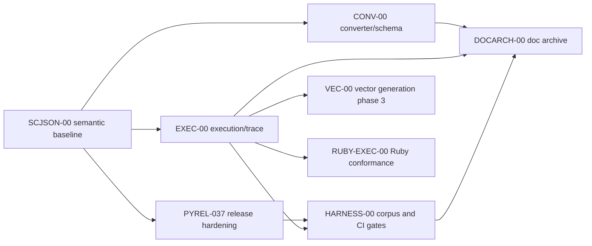

<p align="center"></p>

Agent Name: scjson-workstream-manager-map

Part of the scjson project.
Developed by Softoboros Technology Inc.
Licensed under the BSD 1-Clause License.

# SCJSON-WORKSTREAMS-00 Manager Map

## Section 0. Authority Policy

This document turns the accepted backlog into large, low-coupling workstreams
for a manager model to delegate. It does not authorize code changes by itself;
each workstream points to the governing concepts doc and accepted outputs.

Normative sections: Section 3, Section 4, Section 5, Section 6, and Section 7.

Informative sections: Section 1, Section 2, Section 8, and Section 9.

## Section 1. Manager Goal

Set up work so a manager model can spawn sub-agents without overlapping write
sets or ambiguous dependencies. Workstreams are intentionally coarse enough to
hold coherent context, but narrow enough that agents can own disjoint files.

## Section 2. Global Rules

- Root docs are authoritative. Localized documentation trees are removed and
  must not be regenerated in this repo.
- Apache Commons and Java-reference-runner work is rejected as a Python 0.3.7
  blocker.
- Ruby work is out of scope for Python 0.3.7 unless explicitly limited to
  inventory/docs.
- No worker should edit generated models unless its workstream explicitly owns
  generation.
- TODO checkboxes must be updated in the same change as completed work.

## Section 3. Workstream Dependency Graph



Only the arrows above are hard dependencies. Absence of an arrow means the
workstream can proceed in parallel if write scopes are disjoint.

## Section 4. Workstream Registry

| Workstream | Governing doc | Release scope | Primary write scope | Depends on | May run parallel with |
|------------|---------------|---------------|---------------------|------------|-----------------------|
| PYREL-037 | `PYREL-037-BACKLOG-GROOMING.md` | Python 0.3.7 | `py/tests/`, `py/CHANGELOG.md`, `CHANGELOG.md`, selected Python docs | `SCJSON-00` | CONV-A, EXEC-A, docs cleanup |
| CONV-00 | `SCJSON-CONV-00-CONCEPTS.md` | Partly 0.3.7 | converter docs, schema audit docs, typed metadata tests | `SCJSON-00` | EXEC-A/B, PYREL changelog |
| EXEC-00 | `SCJSON-EXEC-00-CONCEPTS.md` | Partly 0.3.7 | engine docs/tests, unsupported corpus policy | `SCJSON-00` | CONV-B/D |
| HARNESS-00 | future doc | Post-gate or release validation | test harness, submodule policy, CI docs | PYREL-037, EXEC-00 | Ruby inventory if no CI files overlap |
| VEC-00 | future doc | Deferred | vector generator, vector tests, corpus expansion | EXEC-D | CONV docs after field audit |
| RUBY-EXEC-00 | future doc | Deferred | Ruby engine docs/tests/gemspec | EXEC-D | converter docs if no README overlap |
| DOCARCH-00 | future doc | Deferred | archive headers, doc moves, README links | CONV-00, EXEC-00, HARNESS-00 | none touching docs index |

## Section 5. Python 0.3.7 Manager Cut

For a Python bugfix release, spawn at most these independent workers:

### Worker PYREL-A: Root activation regression

Write scope:

- `py/tests/test_engine.py` or a new focused Python test file.

Task:

- Add a regression chart where `<scxml name="menu">` coexists with
  `<state id="menu">`.
- Assert the user state remains visible and transition behavior is observable.

Dependencies: none.

### Worker PYREL-B: Typed metadata regression

Write scope:

- `py/tests/`.
- Optional release-note snippets if the test proves behavior.

Task:

- Add pydantic and pydantic_strict tests for integer/object values in
  `other_attributes`.
- Confirm dataclass string typing remains intentional.

Dependencies: none.

### Worker PYREL-C: Release notes and packaging decision

Write scope:

- `CHANGELOG.md`
- `py/CHANGELOG.md`
- `py/MANIFEST.in` or generator docs, if packaging decision requires it.

Task:

- Add the pydantic `other_attributes` fix to release notes.
- Decide and encode whether generator patch scripts ship in Python source
  distributions.

Dependencies: may consume PYREL-B conclusion.

### Worker EXEC-A: Python time-control docs

Write scope:

- `docs/ENGINE-PY.md`
- possibly `docs/TODO-ENGINE-PY.md`.

Task:

- Correct `advance_time` default behavior and update checklist state.

Dependencies: none.

### Worker HARNESS-A: Tutorial submodule validation policy

Write scope:

- `py/tests/test_cli.py`
- optional `docs/TODO-ENGINE-PY.md` note.

Task:

- Make recursive tutorial tests skip clearly when tutorial data is absent, or
  document that release validation requires initialized tutorial data.

Dependencies: none.

## Section 6. Deferred Manager Cut

After Python 0.3.7, spawn larger initiative workers only after their concepts
docs are accepted:

- CONV-A registry audit.
- CONV-C inference guide replacement.
- EXEC-D invoke/finalize ordering concepts.
- VEC-00 vector minimization and corpus expansion.
- RUBY-EXEC-00 Ruby conformance.
- DOCARCH-00 archive old docs.

## Section 7. Explicit Non-Dependencies

- PYREL-A does not depend on CONV-A.
- PYREL-B does not depend on EXEC-D.
- EXEC-A does not depend on Ruby work.
- HARNESS-A does not depend on Apache Commons or Java runner work.
- DOCARCH-00 must wait for CONV/EXEC/HARNESS, but localized directory removal
  is already complete and does not block any workstream.

## Section 8. Manager Prompt Seed

A manager model can use this prompt shape:

```text
Read docs/concepts/SCJSON-00-CONCEPTS.md,
docs/concepts/PYREL-037-BACKLOG-GROOMING.md,
docs/concepts/SCJSON-CONV-00-CONCEPTS.md,
docs/concepts/SCJSON-EXEC-00-CONCEPTS.md, and
docs/concepts/SCJSON-WORKSTREAMS-00-MANAGER-MAP.md.

Spawn workers only for independent workstreams listed in Section 5. Assign each
worker its write scope. Workers must not edit files outside their scope, must
not update generated models unless assigned generation ownership, and must list
changed files in their final report.
```

## Section 9. Change Log

- 2026-05-14: Initial manager workstream map.
