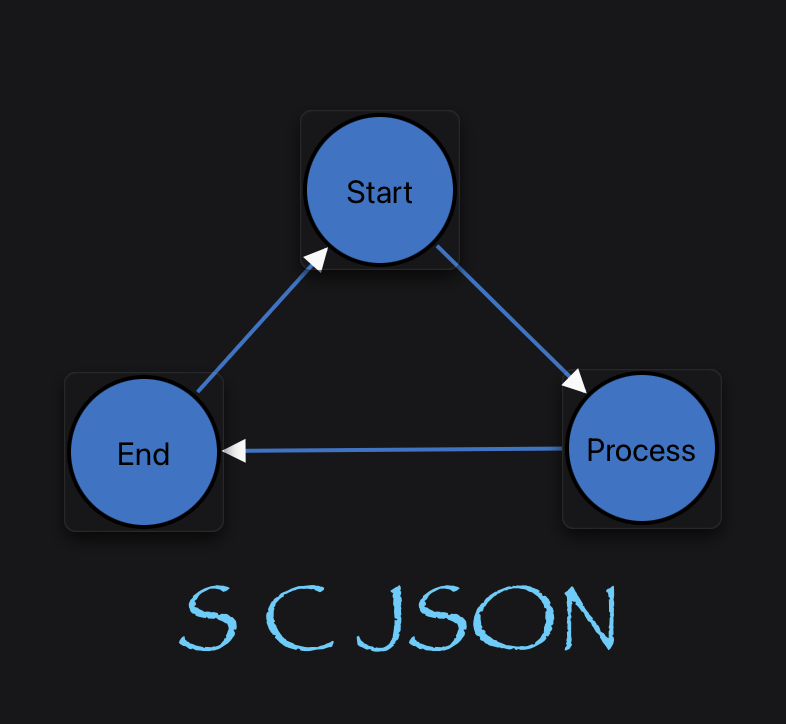

Agent Name: python-engine-reference

Part of the scjson project.
Developed by Softoboros Technology Inc.
Licensed under the BSD 1-Clause License.

# Python Package — Architecture & Reference

This document provides a practical, in-depth reference for the Python `scjson` package: its modules, runtime behaviors, CLI tools, and how they fit together. If you just want quick usage, see the summary below; for a deeper dive, jump to the linked sections.

Quick Start Summary
- CLI overview: scjson CLI supports SCXML↔SCJSON conversion, schema export, engine tracing and verification. See: [CLI](#cli)
- Execution engine: single-file runtime with safe expression evaluation, history/parallel semantics, timers, and invocation. See: [Execution Engine](#execution-engine)
- Tracing and comparison: deterministic JSONL traces, normalization, and [SCION](https://www.npmjs.com/package/scion) reference comparison. See: [Trace Compare](#trace-compare)
- Vector generation and sweep: generate event vectors, measure coverage, and sweep corpora. See: [Vectors & Sweep](#vectors--sweep)
- Packaging: console scripts and modules installed by the Python package. See: [Packaging & Scripts](#packaging--scripts)

Related docs
- docs/ENGINE-PY.md — user‑facing engine guide and CLI usage
- docs/COMPATIBILITY.md — cross-language compatibility and [SCION](https://www.npmjs.com/package/scion) parity notes
- codex/CONTEXT.md — current session context and repro commands
- codex/CONTEXT-EXPANDED.md — expanded context snapshot

## Navigation

- This page: Architecture & Reference
  - [Package Layout](#package-layout)
  - [Execution Engine](#execution-engine)
  - [Safe Expression Evaluation](#safe-expression-evaluation)
  - [Converter](#converter-scxml--scjson)
  - [CLI](#cli)
  - [Invoke Subsystem](#invoke-subsystem)
  - [Timers](#timers)
  - [Trace Compare](#trace-compare)
  - [Vectors & Sweep](#vectors--sweep)
  - [Packaging & Scripts](#packaging--scripts)
  - [Testing & Repro Commands](#testing--repro-commands)
- User Guide: `docs/ENGINE-PY.md`
- Compatibility Matrix: `docs/COMPATIBILITY.md`

---

## Package Layout

Core package modules (directory: `py/scjson`):
- `cli.py` — command line interface (conversion; engine-trace/verify; codegen).
- `context.py` — execution engine (macro/microstep, transitions, history, invoke, timers, error semantics, tracing).
- `events.py` — `Event` and `EventQueue` primitives.
- `activation.py` — activation records and transition specs used by the engine.
- `safe_eval.py` — sandboxed expression evaluation (default) with `--unsafe-eval` override.
- `invoke.py` — lightweight invoker registry and child SCXML/SCJSON handler.
- `SCXMLDocumentHandler.py` — XML↔JSON converter using xsdata/xmlschema.
- `json_stream.py` — decode JSONL streams without relying on newline framing.
- `jinja_gen.py` + templates — code/schema generation helpers for CLI.

Top-level tools (directory: `py/`):
- `exec_compare.py` — run a chart with Python engine and compare vs a reference ([SCION](https://www.npmjs.com/package/scion) by default); JSONL diff with normalization.
- `exec_sweep.py` — sweep a directory of charts; optional vector generation; aggregate results.
- `vector_gen.py` — generate event vectors and coverage sidecars.
- `vector_lib/` — analyzer/search/coverage helpers for vector generation.

---

## Execution Engine

File: `py/scjson/context.py`

Key concepts
- Activations and configuration: An `ActivationRecord` represents an active node (state/parallel/final/history). `configuration` is the set of active activation IDs; it updates during transition microsteps.
- Macro/microstep: `microstep()` processes at most one external event (plus any immediately relevant `done.invoke*` processing); eventless transitions run until quiescent. `run()` loops `microstep()` until the queue empties or a step budget is reached.
- Transition selection: `_select_transition(evt)` iterates document order, supports multi-token events (space-separated), wildcard `*`, and prefix `error.*` patterns. `_eval_condition` runs in a sandbox; non-boolean results produce `error.execution` and evaluate false.
- Entry/Exit/History: `_enter_state`, `_exit_state`, `_enter_history` handle LCA-based entry/exit ordering, shallow and deep history restoration, and `done.state.*` propagation.
- Executable content: `assign`, `log`, `raise`, `if/elseif/else`, `foreach`, `send`, `cancel`, and `script` (warning/no-op). Action execution order is preserved via XML child order or JSON order synthesis.
- Timers: `_schedule_event` and `advance_time(seconds)` implement deterministic timers; the trace/CLI support injecting `{ "advance_time": N }` control tokens to release delayed sends between stimuli.
- Errors: `_emit_error` enqueues `error.execution` (push-front) for evaluation failures and `error.communication` for unsupported external sends or invoke load failures. A generic `error` alias is also emitted for `error.execution` to support charts listening to `error.*`.
- Invoke: `_start_invocations_for_state`, `_on_invoke_done`, `_cancel_invocations_for_state` manage invocation lifecycle; finalize executes in the invoking state with `_event` mapped; parent↔child interaction via `#_parent`, `#_child`/`#_invokedChild`, and `#_<invokeId>`.
- Ordering modes: `ctx.ordering_mode` controls child→parent emission priority and `done.invoke` enqueuing.
  - tolerant (default): child emissions push-front; `done.invoke` pushes front only when no child outputs precede it.
  - strict: child emissions and `done.invoke` enqueue at tail.
  - scion: child emissions enqueue at tail; `done.invoke` is push-front with generic before id-specific, matching [SCION](https://www.npmjs.com/package/scion)’s observable microstep ordering.

Notable helpers
- Safe expressions: `_evaluate_expr()` delegates to `safe_eval` unless `allow_unsafe_eval=True`.
- Trace entry: `trace_step(evt: Event|None)` returns a normalized dict with keys: `event`, `firedTransitions`, `enteredStates`, `exitedStates`, `configuration`, `actionLog`, `datamodelDelta`.

---

## Safe Expression Evaluation

File: `py/scjson/safe_eval.py`

- Default sandbox: The engine evaluates expressions via an allow-listed sandbox (`py-sandboxed`) that blocks imports, dunder access, and unsafe builtins. A curated set of pure builtins (and optionally `math.*`) are exposed.
- CLI controls: `engine-trace` accepts `--unsafe-eval` to bypass the sandbox (trusted charts only); allow/deny patterns and presets can refine exposure when sandboxed.
- Import surface: prefers `py_sandboxed` (your managed package); falls back to `py_sandboxer` for environments that expose the same API under a different name.
- Error semantics: sandbox violations or runtime exceptions raise `SafeEvaluationError`; the engine enqueues `error.execution` and treats the condition as false or the expression value as a literal where applicable.

---

## Converter (SCXML ↔ SCJSON)

File: `py/scjson/SCXMLDocumentHandler.py`

- Parsing/serialization: Uses xsdata’s `XmlParser`/`XmlSerializer` and optional `xmlschema` validation.
- Strict vs lax: `fail_on_unknown_properties=True` enforces strict XML parsing; set `False` to tolerate unknown elements in non-canonical charts.
- JSON normalization: decimals/enums normalized; empty containers stripped by default; text/nested markup in `<content>` preserved into a [SCION](https://www.npmjs.com/package/scion)-compatible JSON structure.

---

## CLI

File: `py/scjson/cli.py`

Commands
- Conversion
  - `scjson json PATH [--output/-o OUT] [--recursive/-r] [--verify/-v] [--keep-empty] [--fail-unknown/--skip-unknown]`
  - `scjson xml PATH [--output/-o OUT] [--recursive/-r] [--verify/-v] [--keep-empty]`
- Validation
  - `scjson validate PATH [--recursive/-r]` (round-trip in memory)
- Engine
  - `scjson engine-trace -I CHART [--xml] [-e EVENTS] [--out OUT] [--lax/--strict] [--advance-time N] [--leaf-only] [--omit-actions] [--omit-delta] [--omit-transitions] [--ordering MODE] [--unsafe-eval|--expr-*]`
  - `scjson engine-verify -I CHART [--xml] [--advance-time N] [--max-steps N] [--lax/--strict]`
- Codegen & schema
  - `scjson typescript -o OUT` / `scjson rust -o OUT` / `scjson swift -o OUT` / `scjson ruby -o OUT`
  - `scjson schema -o OUT` (writes `scjson.schema.json`)

Trace options
- Leaf-only mode, omit action/delta/transitions, and `--advance-time` to flush timers deterministically before processing events.

---

## Invoke Subsystem

File: `py/scjson/invoke.py`

- Registry & handlers: `InvokeRegistry` with mock handlers (`mock:immediate`, `mock:record`, `mock:deferred`) and child machine handlers for `scxml`/`scjson`.
- Child machines: Built via `DocumentContext._from_model` with deferred initial entry so onentry sends can bubble before parent sees `done.invoke`.
- Parent↔child I/O: Child emits with SCXML Event I/O metadata (`origintype`, `invokeid`) and supports `#_parent` sends; parent can address child by `#_child`/`#_invokedChild` or `#_<invokeId>`.
- Finalize semantics: `<finalize>` runs in the invoking state; `_event` contains `{name, data, invokeid}`.

---

## Timers

- Scheduling: `<send delay|delayexpr>` is scheduled relative to the engine’s mock clock (`_timer_now`).
- Control: `advance_time(seconds)` releases ready timers; CLI accepts `--advance-time N` and `{ "advance_time": N }` control tokens inside events streams.

---

## Trace Compare

File: `py/exec_compare.py`

- Purpose: run Python engine vs reference ([SCION](https://www.npmjs.com/package/scion) Node by default) and diff JSONL traces.
- Normalization: leaf-only filtering; step-0 noise stripping (`datamodelDelta`, `firedTransitions`), optional stripping of step-0 entered/exited; sorted `datamodelDelta` keys.
- Reference: auto-resolves to `tools/scion-runner/scion-trace.cjs` when available (or override `SCJSON_REF_ENGINE_CMD`).
- Vectors: can generate vectors on the fly (`--generate-vectors`) and adopt recommended `advanceTime` from vector meta.

---

## Vectors & Sweep

File: `py/vector_gen.py`, helpers in `py/vector_lib/`

- Analyzer: extracts an event alphabet from transitions and simple invoke hints; payload heuristics from `cond` expressions.
- Search: coverage-guided BFS over alphabet (`vector_lib.search.generate_sequences`); supports data-bearing stimuli.
- Generation: write `.events.jsonl`, `.coverage.json`, and `.vector.json` (metadata with `advanceTime`). Adds `{ "advance_time": N }` between stimuli when timers are pending.
- Sweep: `py/exec_sweep.py` discovers charts, generates vectors when missing, compares traces, and aggregates coverage.

---

## Packaging & Scripts

File: `py/pyproject.toml`

- Version: `0.3.4`
- Dependencies: `pydantic`, `lxml`, `jsonschema`, `click`, `py-sandboxed` (sandbox), `jinja2`, `xmlschema`, `xsdata`.
- Console scripts:
  - `scjson` — main CLI
  - `scjson-exec-compare` — compare traces vs reference
  - `scjson-exec-sweep` — sweep directories with optional vector generation
  - `scjson-vector-gen` — standalone vector generator
- Modules installed: `exec_compare`, `exec_sweep`, `vector_gen`

---

## Testing & Repro Commands

- Unit tests: `PYTHONPATH=py pytest -q py/tests`
- Engine quick checks (SCXML):
  - `PYTHONPATH=py python -m scjson.cli engine-verify -I tutorial/.../test253.scxml --xml --advance-time 3`
  - Repeat for: 338, 422, 554 → expected pass
  - `test401.scxml` (error precedence) passes without `--advance-time`
- Trace compare: `python py/exec_compare.py <chart.scxml> --events <events.jsonl>`
- Vector gen: `python py/vector_gen.py <chart.scxml> --xml --out vectors/`

---

## Known Limitations & Compatibility Notes

- External processors: External `<send>` targets (other than `#_parent`, `_internal`) are not executed; engine emits `error.communication` and skips delivery.
- Step-0 visibility: Engines differ on initial transitions; normalization mitigates diffs.
- Invoke ordering: `scion` mode aligns `done.invoke` enqueuing with [SCION](https://www.npmjs.com/package/scion); `tolerant/strict` modes provide flexible alternatives.

---

## Appendix: Trace Schema (Engine Steps)

Each step produced by `trace_step` or `engine-trace` includes:
- `event`: `{name, data}` of the consumed external event (or `null` for step 0)
- `firedTransitions`: `[{source, targets[], event, cond}]` filtered to user states
- `enteredStates` / `exitedStates`: lists of state IDs (leaf-filtered when requested)
- `configuration`: current active state IDs (leaf-filtered when requested)
- `actionLog`: `log` entries, optionally omitted
- `datamodelDelta`: changed keys since previous step, with sorted keys (optionally omitted)

---

## Appendix: Glossary

- Activation: A runtime record of an entered SCXML node (state/parallel/final/history).
- Configuration: The set of currently active activation IDs.
- Macrostep: One `microstep()` plus draining of eventless transitions to quiescence.
- [SCION](https://www.npmjs.com/package/scion): Reference SCXML engine used for behavior comparison.

---

Back to
- User Guide: `docs/ENGINE-PY.md`
- Compatibility Matrix: `docs/COMPATIBILITY.md`
