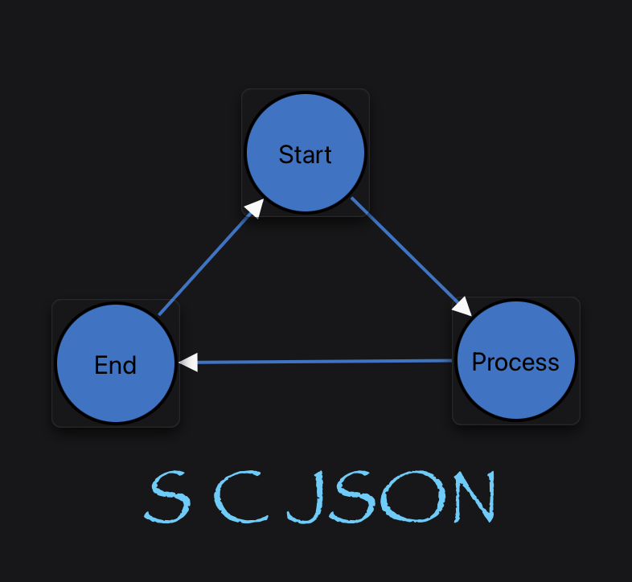

<p align="center"></p>

# scjson Swift Package

This directory contains the Swift implementation of **scjson**. The package exposes a reusable library (`SCJSONKit`) and a command line tool that can convert between `.scxml` and `.scjson` and perform validation using the shared schema.

## Installation

```bash
swift build -c release
```

After building, the `scjson` executable will be available in `.build/release`.

## Library Usage

Add `SCJSONKit` as a dependency in your `Package.swift` and import the models:

```swift
import SCJSONKit

let doc = ScjsonDocument.makeDefault()
let encoded = try doc.encode()
let decoded = try ScjsonDocument.decode(from: encoded)
```

### Swift Package Manager

```swift
// Package.swift
dependencies: [
    .package(url: "https://github.com/softoboros/scjson-swift.git", from: "0.1.0")
]

// Target declaration
.target(
    name: "YourFeature",
    dependencies: [
        .product(name: "SCJSONKit", package: "scjson-swift")
    ]
)
```

### Documentation

You can browse the DocC catalog in Xcode (Product ▶ Build Documentation) or generate static docs via:

```bash
swift package generate-documentation --product SCJSONKit
```

## Documented API Surface

Every public symbol ships with DocC-friendly documentation comments so Xcode can display quick help and build full documentation. Highlights include:

- ``JSONValue`` and ``JSONDictionary`` for working with raw SCJSON scalars and objects.
- ``ScjsonCodable`` convenience protocol plus `encode`/`decode` helpers.
- Schema-derived models such as ``ScjsonDocument`` (alias of ``ScxmlProps``), ``AssignProps``, ``TransitionProps`` and all supporting arrays/collections.
- Enumerations including ``AssignType``/``AssignTypeDatatypeProps`` and ``ScjsonKind`` for union dispatch.

Generated sources live in `Sources/SCJSONKit/ScjsonTypes.swift`; edit the templates in `py/scjson/templates/` if you need to tweak the emitted docs or types.

## Command Line Usage

```bash
scjson json path/to/machine.scxml
scjson xml path/to/machine.scjson
scjson validate path/to/dir -r
```

## Repository Guide

- `Sources/SCJSONKit/SCJSONKit.docc` – DocC catalog describing the library surface.
- `Sources/SCJSONKit/ScjsonTypes.swift` – Generated Codable models.
- `CONTRIBUTING.md` – Workflow and coding conventions when contributing to the Swift package.
- `CHANGELOG.md` – Release log and upgrade notes.

All source code in this directory is released under the BSD 1-Clause license. See [LICENSE](./LICENSE) and [LEGAL.md](./LEGAL.md) for details.
